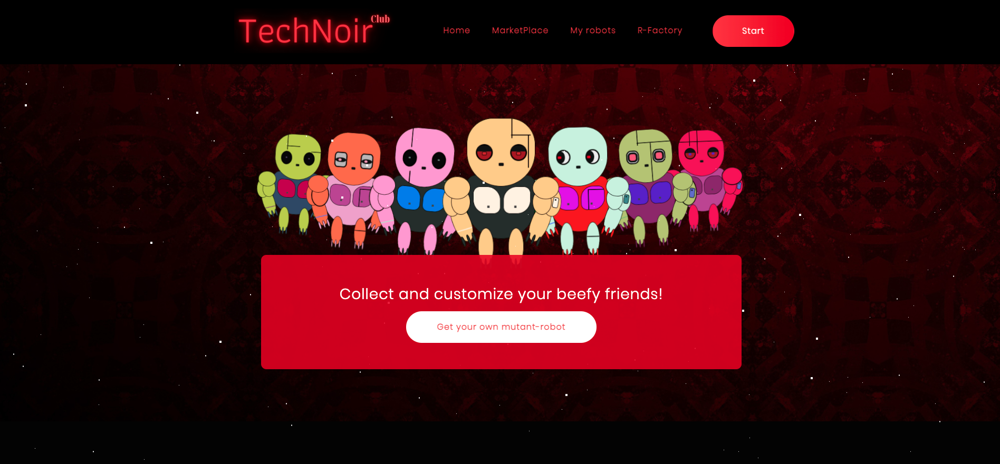

# TechNoir Club
> ERC721 collection of Robot-Mutants with integrated  NFT marketplace and modifying features
> Video explanation [_here_](https://drive.google.com/file/d/1JPvMUQxbuEBp40pdK7pxdyd1Wr5WGBuu/view?usp=sharing). 

## 📁 Table of Contents
* [General Info](#-general-information)
* [Technologies Used](#-technologies-used)
* [Features](#-features)
* [Screenshots](#-screenshots)
* [Requirements For Initial Setup](#-requirements-for-initial-setup)
* [Setup](#-setup)
* [Room for Improvement](#-room-for-improvement)
* [Contact](#-contact)

## 🚩 General Information
- Users can mint their unique robots 
- Users can modify and create new robots from parts of 2 another robots 
- Users can buy / sell robots from other users from integrated marketplace


## 💻 Technologies Used
- hardhat - version 2.10.1
- node - version 16.15.0
- HTML, CSS and ES6 JS
- hh coverage
- slither
- solhint
- docgen


## 🌟 Features
List the ready features here:
- Awesome Frontend
- Trillions of different robots combination. Every robot is totally unique!
- Modyfying feature. User can create new generation robot from two another robots!
- Build-in marketplace


## 🎦 Screenshots




## 👀 Requirements For Initial Setup
- Install [NodeJS](https://nodejs.org/en/), should work with any node version below 16.16.0
- Install [Hardhat](https://hardhat.org/)


## 📟 Setup
### 1. 💾 Clone/Download the Repository
### 2. 📦 Install Dependencies:
```
$ cd lottery_file
$ npm install
```
### 3. 🔍  .env environment variables required to set up
Create .env file inside project folder
- You can get your ethereum or testnet API key [here](https://infura.io/dashboard/ethereum),[here](https://www.alchemy.com) or any other service that allow you to connect to the nodes
- You can get your private key from your wallet (Don't share your private key with untrusted parties) 
- Subscription id can be obtained here after creation of subscription [here](https://vrf.chain.link)
- Key Hash and address of vrf coordinator can be obtained from here [here](https://docs.chain.link/docs/vrf-contracts) Just choose network and copy:)
- You can get your etherscan API -key [here](https://etherscan.io/myapikey).
- LOT_ADDRESS be available after deploying contracts
```
GOERLI_API = <GOERLI API key>
MAINNET_API = <Ethereum mainnet API key>
PRIVATE_KEY = <Private key of your wallet u want to deploy contracts from>
ETHERSCAN_KEY = <Etherscan API key in order to verify your contracts>
GEN_0_LIMIT = <Limit of gen 0 robots to be created>
```


### 4. ⚠️ Run Tests
```
$ npm run test
```

```
$ npm run coverage
```

### 5. 🚀 Deploy to Goerli or Mainnet
(🧐 Remember to have ether in your wallet to deploy contracts 🙄)
```
$ npm run goerli
``` 
```
$ npm run mainnet 
``` 

!!!Important!!! 
insert current token contract address into your environment variables

### 6. ✏️ Insert current contract addresses into package.json


### 7. 📜 Verify contracts
```
$ npm run goerli:verify 
```
or for mainnet
```
$ npm run mainnet:verify
```


## 📈 Room for Improvement

Room for improvement:
- Go live Ethereum network
- Make great marketing
- Go OpenSea and other NFT marketplaces


## 💬 Contact
Created by [@LESKOV](https://www.linkedin.com/in/ivan-lieskov-4b5664189/) - feel free to contact me!
